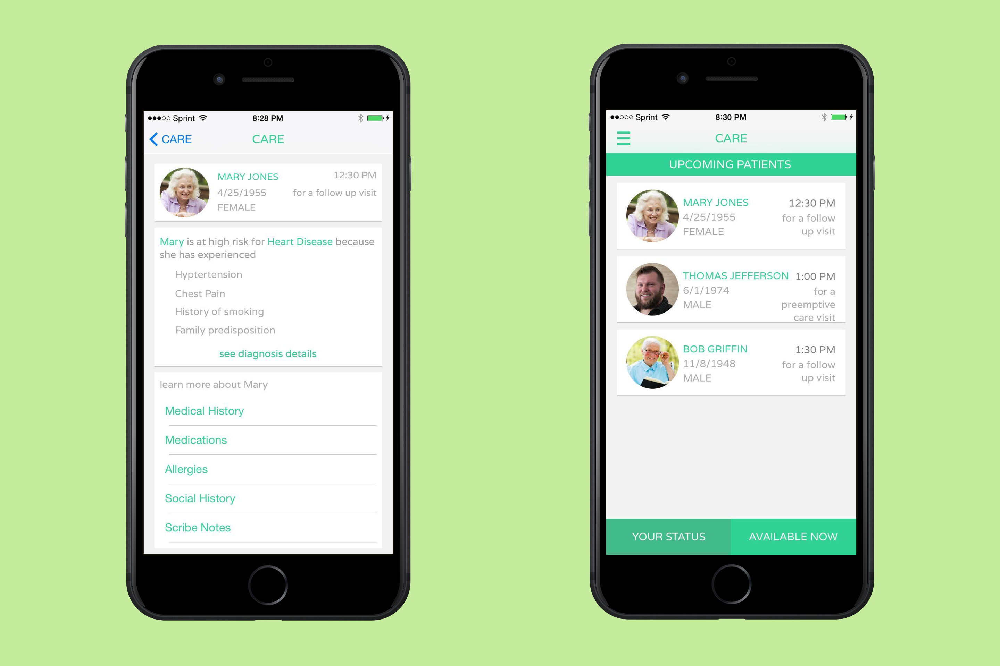

# CARE

#### An iOS app aims to address the time constraints of doctors.

## Background

CARE was originally a first-place project of [the FHIR Health App Design Challenge](http://healthit.cns.utexas.edu/health-app-design-challenge). My team also includes Enrique Sotomayer, Esaias Tong, Daniel Santa Maria, and Brian Vodicka. [Here](http://www.dailytexanonline.com/2016/02/16/students-compete-to-make-the-best-health-app) is the report for the challenge.[INF 385T Interaction Design](https://www.ischool.utexas.edu/courses/class_details?ClassID=4003)

Imagine that you're a physician. Fundamentally, your job is the same each day: to treat your patients. But realistically, no two days are the same. Each patient presents different challenges, and you have to help each one uniquely. This problem is even harder because physicians don't know which patients they will see next in any day. Ultimately, this leads to worsening understanding between doctors and patients. CARE predicts each patient's individual problems, and gives the doctor a hypothesized clinical diagnosis. This way the doctor knows what to expect before he even sees the patient, and can ask the right questions more quickly.

## Core Functionality and Value

CARE uses data from a variety of sources. One thing we noticed was that each of the cases were likely to be on Medicare, so we thought using the CMS datasets would fit this competition. Capturing and combining these data sources is essential to understand the healthcare environment. By clustering data from millions of patients, we use machine learning to understand what each patient is going through. We can identify similar patients with similar backgrounds to predict patient outcomes. We analytically look at data received from the FHIR API. In addition, we use linguistic analysis to detect and interpret emotional, social, and language cues found in the narrative to provide a portrait of the patient. We read through the noise and present doctors with the information that is ranked as the most important in the patient’s narrative. That way doctors aren't inundated with information; what's important is right in front of them.

## Design

To deliver these insights, we've also designed CARE with the physician user in mind. CARE allows providers to access patient data via FHIR anywhere through their smartphone. We strongly believe that helping doctors understand their patient in one quick glance on the go provides great value. CARE understands the daily juggling act that providers deal with every day, even outside of the office. CARE allows users to have access to the vital information that resides on their computer without having to touch their office computer. This proves particularly useful when in between patient visits, when doctors are on call after hours to view patient data. The product offers access to patients’ information with a tap of the screen enabling doctors to provide their patients the best care possible and in a timely manner.
