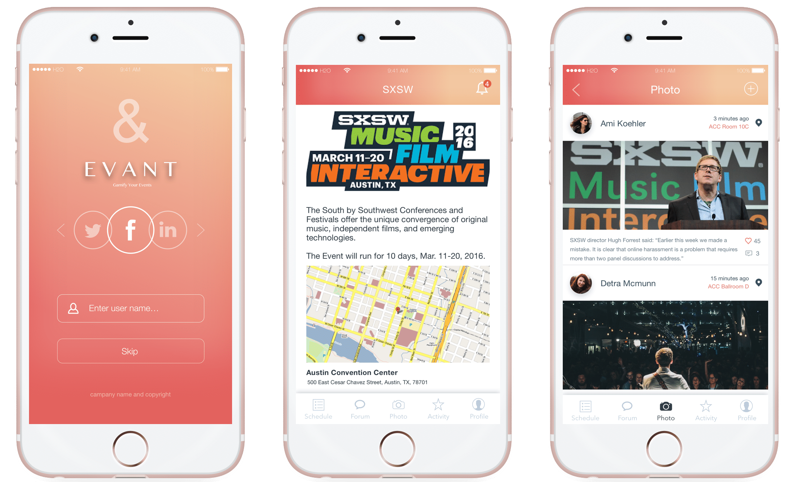
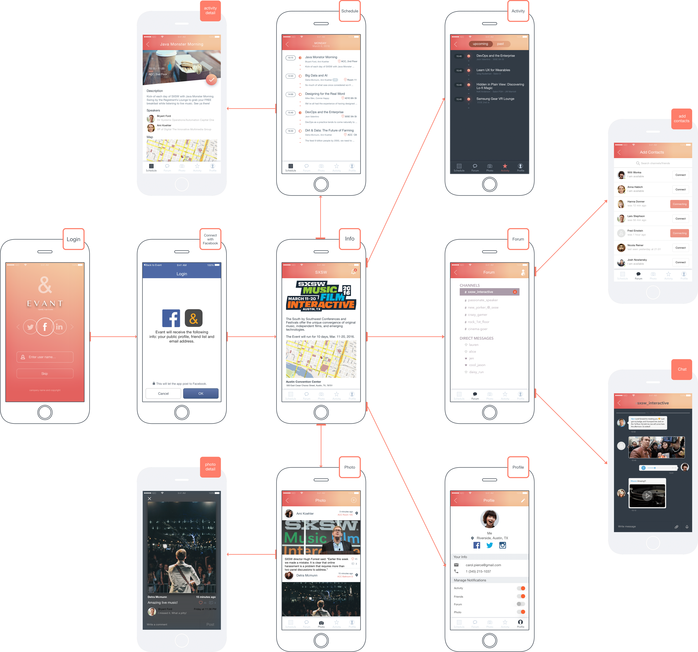

# Evant

#### An iOS app that revolutionizes event engagement and networking.

## Background

This was originally a final project of the class [INF 385E Information Architecture and Design](https://www.ischool.utexas.edu/courses/class_details?ClassID=3832) taught by [Fleming Seay](http://www.cs.cmu.edu/~afseay/) at UT Austin. My team also includes Haowei Sun, Shengwei Wang, and Calvin Bench. The high-fidelity prototype can be found [here](https://invis.io/F96U3AB5J).

Evant is an iOS app that focuses on augmenting events through helping event guests manage activity schedules, share content (photos, memes, information, etc.), socialize and interact with the event and event coordinator. The idea for the app came about several years ago with a different group of developers and has had the opportunity to evolve a bit. We have been fortunate to pick up where this previous team left and hit the ground running.

## Concept

The interaction of this app is based on features of the app like a robust, personalized schedule, photo sharing platform, a ‘Slack’-like forum that manages notifications shared by the event organizer and a customized event information page with a map and other contact information. An additional function under the hood of this app is that it will have a geo-fence around the event location so the app can’t be dynamically accessed once the attendee leaves the event. The content will be available only once an attendee enters the event and can only be accessed in a read-only format after the event.

## Research and Design

At the beginning of research phrase, we interviewed people to get general idea of what they enjoyed about events and how an app might enable more activity or address pain points. We separated people into User Group and Coordinator Group to ask target questions. We collected data related to both physical and digital interactions at events and people’s likes and dislikes related to the event space. We also asked for ideas to improve the event experience. From the interview, we knew that event attendees would like to share photos on the social media platform.

After the interview, we designed and conducted the survey focusing on specific questions. We were motivated to determine trends for why people like attending events, what kind of events they enjoy and most often attend, why they like or dislike events and their opinions about the function of social media relative to events. In the light of the results of the survey, more than 70% respondents thought the interaction and organizing in events were not satisfying.

We extracted important insights from user research and used affinity diagram to form site structure and key features. Also, we defined personas to better guide future design and development of site.

## Prototyping and Usability Testing

From the beginning of paper wireframe to the final Hi-fi prototype, we practiced an iterative workflow in which user testing was consistently implemented throughout the whole process. We run usability testing after each version of prototype and tried to improve the next version of prototype based on user feedbacks. In total, we created 5 versions of prototype and 5 rounds of usability testing.

